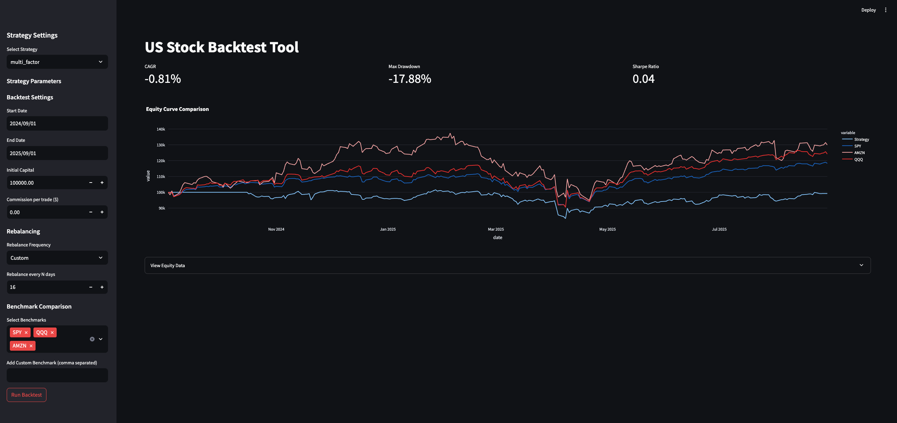

# Stock Backtest

A modular, fundamental-focused backtesting engine for US stocks.



## Features
- **Data Management**: Fetches price and financial data (Balance Sheet, Income Statement) using `yfinance`.
- **Look-ahead Bias Protection**: Automatically aligns financial data with price data, applying lags to simulate realistic reporting delays.
- **Strategy Engine**: Supports custom strategies with flexible signal generation.
- **Interactive UI**: Streamlit-based dashboard for running backtests and visualizing equity curves.

## Prerequisites
- Python 3.8+

## Installation
```bash
pip install -r requirements.txt
```

## Usage
To launch the interactive dashboard:
```bash
streamlit run app.py
```

> **Important**: `yfinance` only provides recent financial data (~8 quarters). For fundamental strategies, use backtest dates from **2024 onwards** where financial data is available.

## Project Structure
- `data_manager.py`: Handles data fetching and alignment.
- `strategy_engine.py`: Core backtest logic and performance calculation.
- `strategies/`: Folder containing strategy implementations.
  - `base_strategy.py`: Abstract base class for all strategies.
  - `value_roe.py`: Low P/B + High ROE strategy.
  - `fundamental_value.py`: Low P/B or Low P/E strategy.
  - `multi_factor.py`: Multi-factor strategy (Market Cap, Free Cash Flow, ROE, Operating Income Growth, Price-to-Sales).
- `app.py`: Streamlit frontend.